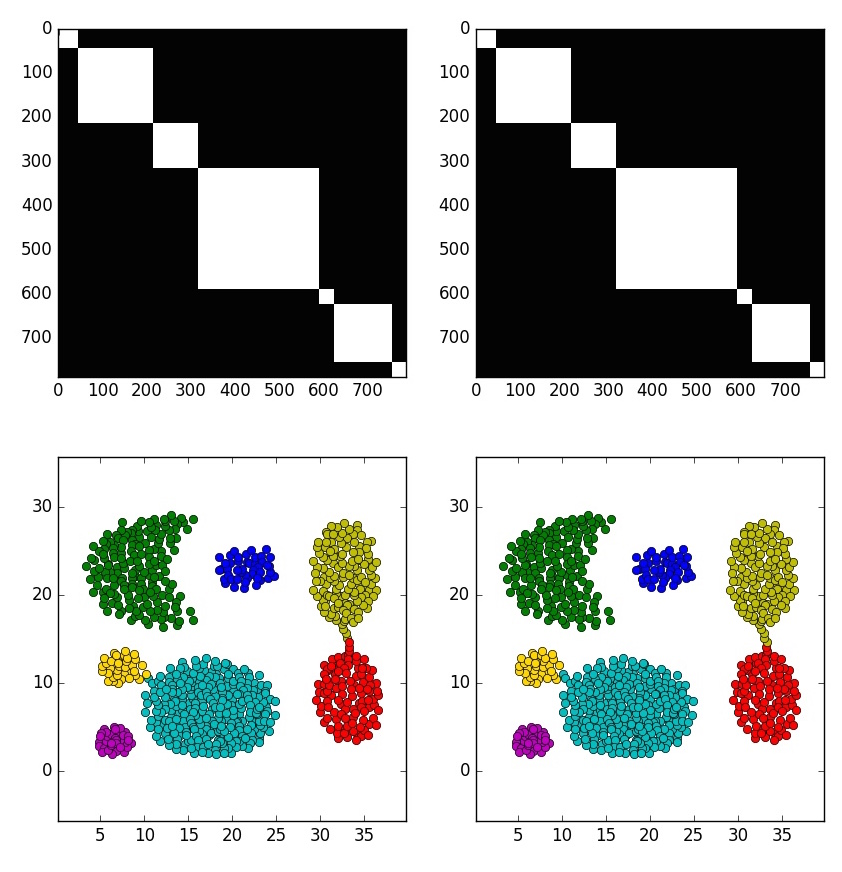

[](http://quantlet.de/index.php?p=info)

## [](http://quantlet.de/) **awc** [](http://quantlet.de/d3/ia)

```yaml

Name of Quantlet : awc

Published in : Not yet

Description : Test Adaptive Weights Clustering on several data sets.

Keywords : cluster-analysis, kullback-leibler, nonparametric, data visualization, data mining

Author : Kirill Efimov, Larisa Adamyan, Vladimir Spokoiny

Submitted [python] : Wed, September 19 2016 by Larisa Adamyan

Datafile : aggregation.arff, compound.arff, ds4c2sc8.arff, pathbased.arff, orange2.txt

Input : 'datafile name and lambda parameter, e.g. aggregation.arff 4.5. If nothing is given awc
will run all data sets listed above.'

Output : 'plot of 4 windows: 1. the weight matrix at the final step (white means 1, black is 0), 2.
true weight matrix, 3. clustering based on the weight matrix, 4. true/wanted clustering.'

Example : 'run python awc.py aggregation.arff 4.5 to see the clustering results on the aggregation
datafile.  By running python awc.py without specifying arguments, awc will run on the all listed
data files.'

```




### PYTHON Code:
```python

from AWC_KL import *
import os

def load_dataset(filename):
    path = os.path.dirname(os.path.abspath(__file__)) + '/'
    X = np.genfromtxt(path + filename)

    if np.isnan(X).any():
        X = np.genfromtxt(path + filename, delimiter=',')
    Y = X[:,-1]
    Y = np.asarray(map(int, Y))
    X = X[:, :-1]
    X = X[Y.argsort()]
    Y = Y[Y.argsort()]
    n = np.size(X,0)
    true_clusters = []
    cluster_marker = []
    for i in xrange(n):
        if Y[i] in cluster_marker:
            true_clusters[cluster_marker.index(Y[i])].append(i)
        else:
            cluster_marker.append(Y[i])
            true_clusters.append([i])
    return X, Y, true_clusters

def get_true_weights(X, Y):
    n = np.size(X, 0)
    true_weights = np.zeros((n, n))
    for i in range(n):
        for j in range(n):
            if Y[i] == Y[j]:
                true_weights[i, j] = 1
    return true_weights


def run_awc(filename, lamda):
    X, Y, true_clusters = load_dataset(filename)
    true_weights = get_true_weights(X, Y)
    weights = cluster(X=X, l=lamda, true_clusters = true_clusters,true_weights=true_weights, show_step = 0, show_finish =True, T_stat_show = False, clustering = 1, log_show=True)
    error1, error2 = get_error(weights, true_weights, True)
    error = get_error(weights, true_weights, False)
    print 'errors:', error1, error2, error
    print 'lamda:', lamda 

import sys

def main(argv):
    if len(argv) >= 1:
        filename = argv[0]
        lamda = float(argv[1])
        run_awc(filename, lamda)
    else:
        run_awc('compound.arff', 3.9)
        run_awc('pathbased.arff', 4.5)
        run_awc('ds4c2sc8.arff', 3.5)
        run_awc('aggregation.arff', 4.5)
        run_awc('orange2.txt', 3)
    
if __name__ == '__main__':
    main(sys.argv[1:])
    
```
